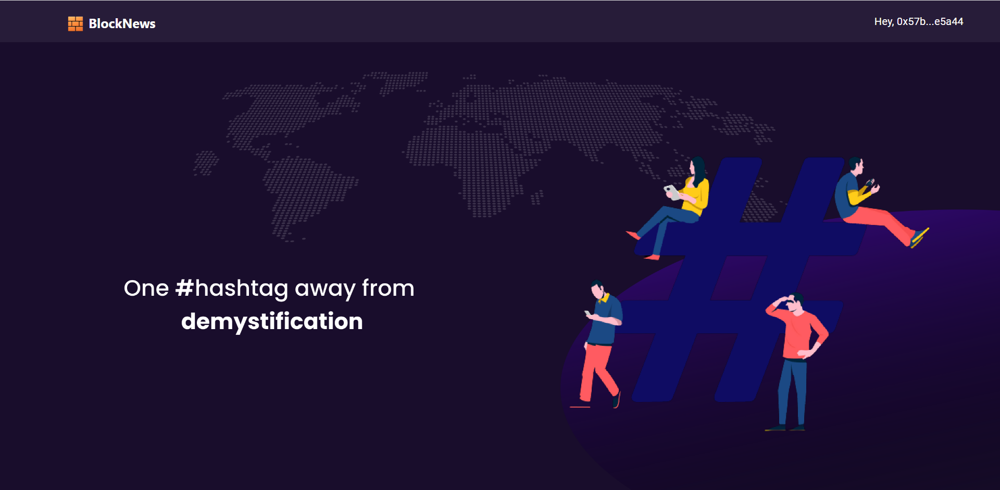
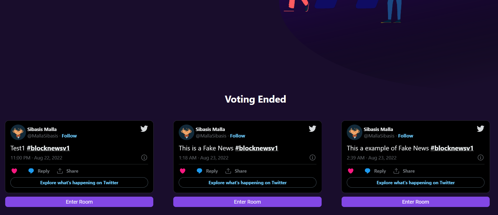
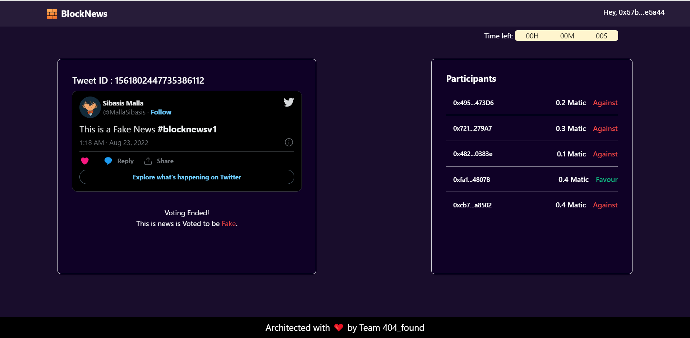

<!-- ALL-CONTRIBUTORS-BADGE:START - Do not remove or modify this section -->
[](#contributors-)
[](https://opensource.org/licenses/MIT)
<!-- ALL-CONTRIBUTORS-BADGE:END -->

<!-- Other badges-->


	
<!-- Other badges-->

<br />
<p align="center">
  <a href="https://github.com/Sibasis-Malla/pilot">
    
  </a>

  <h3 align="center">BlockNews</h3>

  <p align="center">
    The official repository for the website of BlockNews
    <br />
    <a href="https://blocknews.vercel.app/">View Live</a>
    ·
    <a href="https://youtu.be/-tqm3CNbFnI">Project Demo</a>
  </p>
</p>

<!-- TABLE OF CONTENTS -->
<details open="open">
  <summary>Table of Contents</summary>
  <ol>
    <li>
      <a href="#about-the-project">About The Project</a>
      <ul>
      </ul>
        <li><a href="#built-with">Built With</a></li>
    </li>
    <li>
      <a href="#getting-started">Getting Started</a>
      <ul>
        <li><a href="#prerequisites">Prerequisites</a></li>
        <li><a href="#running-the-project">Running the project</a></li>
      </ul>
    </li>
    <li><a href="#problem-it-solves">Problem it solves</a></li>
    <li><a href="#screenshots">Screenshots</a></li>
    <li><a href="#contributors">Contributors</a></li>
  </ol>
</details>

## About The Project

BlockNews is a Decentralised web application which allows users to prove a piece of news is fake or original and thus helps in reducing the spread of misinformation. It works on the concept of 'wisdom of crowd' and employs an motivational approach of 'carrot and stick' to fact check. To Fact check a news tweet anyone on twitter needs to just retweet the news tweet with a given #hashtag(in the tweet), and after that volunteers from anywhere over the world can participate in the fact checking process to research this piece of news and after it is completed they can stake some amount of MATIC against their opinion to prove their inclination towards their decision on the particular news. After the voting ends the result is calculated on the basis of the votes of the participants and then the stakes of losing party is distributed among the proper researchers in the ratio of their stakes locked.

## Built With

Following technologies and libraries are used for the development of this website

- [React](https://reactjs.org/)
- [Gelato Ops](https://app.gelato.network/)
- [Tailwind CSS](https://tailwindcss.com/)
- [Twitter](https://developer.twitter.com/en)
- [MongoDB](https://www.mongodb.com/)
- [Vercel](https://vercel.com/)

## Getting Started

To setup the project locally the steps below.

### Prerequisites

- Please make sure you have [metamask](https://metamask.io/) installed and connected to polygon's mumbai testnet and have some test matic in your wallet

- [Node.js](https://nodejs.org/en/download/)

  ```sh
  # Homebrew
  brew install nodejs

  # Sudo apt
  sudo apt install nodejs

  # Packman
  pacman -S nodejs

  # Module Install
  dnf module install nodejs:<stream> # stream is the version

  # Windows (chocolaty)
  cinst nodejs.install

  ```

- [Git](https://git-scm.com/downloads)

```sh
  # Homebrew
  brew install git

  # Sudo apt
  apt-get install git

  # Packman
  pacman -S git

  # Module Install (Fedora)
  dnf install git

```


### Running the project.

The project uses NPM. It is strictly advised to stick with NPM so as to avoid dependency conflicts down the line.

```
## Checkout into the project client directory
cd client

## Install Dependencies
npm install

## Run the Project
npm start

```

Following are the commands to remove/add new dependencies using yarn

```
## Add a new Package
npm install <package-name>

## Remove an existing Package
npm uninstall <package-name>

## Save Package as a Dev Dependency
npm install <package-name> --save-dev
```

## Problem it solves

* Fake News are created on an Industrial scale to spread virally. -Current infrastructure to detect fake news is unscalable, slow and sometimes even biased.
* People are not interested in searching for the truth behind the information. graph called Lens Protocol.
* Some data may be faked to get the attention of the targeted audiences.
* People blindly follow the fact displayed to them, which leads to chaotic situations.

## Screenshots





## Contributors ✨

Thanks goes to these wonderful people ([emoji key](https://allcontributors.org/docs/en/emoji-key)):

<!-- ALL-CONTRIBUTORS-LIST:START - Do not remove or modify this section -->
<!-- prettier-ignore-start -->
<!-- markdownlint-disable -->
<table>
  <tr>
    <td align="center"><a href="https://github.com/sambit-sankalp"><br /><sub><b>Sambit Sankalp</b></sub></a><br /><a href="https://github.com/sambit-sankalp/project-pilot/commits?author=sambit-sankalp" title="Code">💻</a></td>
    <td align="center"><a href="https://github.com/Sibasis-Malla"><br /><sub><b>Sibasis-Malla</b></sub></a><br /><a href="https://github.com/sambit-sankalp/project-pilot/commits?author=Sibasis-Malla" title="Code">💻</a></td>
  </tr>
</table>

<!-- markdownlint-restore -->
<!-- prettier-ignore-end -->

<!-- ALL-CONTRIBUTORS-LIST:END -->

This project follows the [all-contributors](https://github.com/all-contributors/all-contributors) specification. Contributions of any kind welcome!